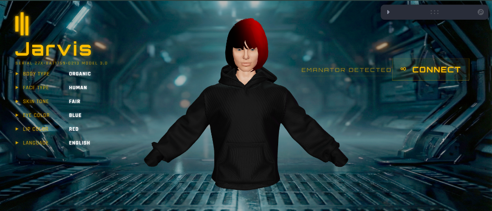
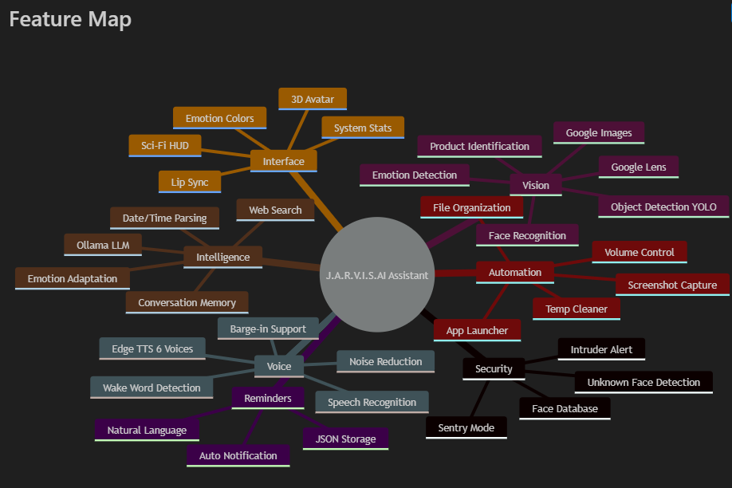

# JARVIS AI Assistant with 3D Avatar Interface

**Advanced Hybrid AI Assistant** featuring a realistic 3D avatar interface powered by React and Three.js, combined with a Python AI backend for computer vision, voice synthesis, and desktop automation.


*Jarvis 3D Avatar Interface with real-time HUD overlay and customizable appearance*

## 🧠 System Architecture

This project runs on a **parallel multi-threaded architecture** with two main components:

### Backend (Python)
| Component | Technology | Purpose |
|-----------|------------|---------|
| **Core Logic** | Python 3.10+ | Central brain handling decision making |
| **Vision** | **YOLOv8** + **DeepFace** + **FaceNet** | Object Detection & Face Recognition & Face Tracking |
| **Voice Input** | **SpeechRecognition** + **PyAudio** | Real-time voice commands with wake word detection |
| **Voice Output** | **Edge TTS** + **PyGame** | High-quality neural voice synthesis with async playback |
| **Communication**| **WebSockets** (Port 8765) | Real-time sync between Backend & Frontend |
| **Search** | **Selenium** | Automated Product Search (Google Lens) |
| **Automation** | **PyAutoGUI** + **PsUtil** | Desktop control and system monitoring |

### Frontend (React + Three.js)
| Component | Technology | Purpose |
|-----------|------------|---------|
| **3D Rendering** | **React Three Fiber** + **Three.js** | Real-time 3D avatar rendering |
| **Avatar Model** | **GLTF/GLB** with skinned mesh | High-quality character with morph targets |
| **UI Controls** | **Leva** | Real-time avatar customization interface |
| **Post-Processing** | **React Three Postprocessing** | Bloom, vignette, and cinematic effects |
| **Build Tool** | **Vite** | Fast development and optimized builds |
| **WebSocket Client** | Native WebSocket API | Real-time communication with Python backend |



### TL;DR - Quick Start (Copy & Paste)
```bash
# Backend Setup
conda create -n jarvis python=3.10 -y && conda activate jarvis
conda install -c conda-forge h5py=3.11.0 -y
pip install deepface==0.0.79 opencv-python==4.8.1.78 ultralytics edge-tts pygame SpeechRecognition PyAudio websockets selenium requests psutil pyautogui pandas numpy Pillow gdown tqdm retina-face mtcnn tensorflow==2.13.0 keras==2.13.1 tensorflow-io-gcs-filesystem==0.31.0

# Frontend Setup (in new terminal)
cd web_interface && npm install && npm run dev

# Start Backend (in first terminal)
python setup.py

## ⚙️ Environment Setup

### Prerequisites
- **Python**: 3.10 or 3.11 (recommended)
- **Node.js**: 16+ (for frontend)
- **Conda**: Anaconda or Miniconda (recommended for Python environment)
- **Webcam**: Required for face recognition and tracking

### Option 1: Quick Setup (Conda - Recommended)

#### Step 1: Create and activate conda environment
```bash
# Create conda environment with Python 3.10
conda create -n jarvis python=3.10 -y
conda activate jarvis
```

#### Step 2: Install Python dependencies (One command!)
```bash
# Install h5py from conda-forge first (critical for Windows)
conda install -c conda-forge h5py=3.11.0 -y

# Install all Python packages
pip install deepface==0.0.79 opencv-python==4.8.1.78 ultralytics edge-tts pygame SpeechRecognition PyAudio websockets selenium requests psutil pyautogui pandas numpy Pillow gdown tqdm retina-face mtcnn tensorflow==2.13.0 keras==2.13.1 tensorflow-io-gcs-filesystem==0.31.0
```

**Or use the requirements.txt:**
```bash
pip install -r requirements.txt
```

#### Step 3: Install Node.js dependencies for frontend
```bash
cd web_interface
npm install
cd ..
```

### Option 2: Automated Setup (Windows Only)

Run the provided batch script:
```bash
# First create conda environment named 'ass' or modify script
conda create -n ass python=3.10 -y
conda activate ass

# Then run the installer
install_dependencies.bat
```

### Option 3: Manual Setup (Without Conda)

#### Python (using venv)
```bash
# Create virtual environment
python -m venv jarvis_env

# Activate (Windows)
jarvis_env\Scripts\activate

# Activate (Linux/Mac)
source jarvis_env/bin/activate

# Install dependencies
pip install -r requirements.txt
```

#### Node.js
```bash
cd web_interface
npm install
cd ..
```

### Troubleshooting Installation

#### PyAudio Installation Fails (Windows)?
```bash
# Download precompiled wheel from:
# https://www.lfd.uci.edu/~gohlke/pythonlibs/#pyaudio
# Then install:
pip install PyAudio-0.2.11-cp310-cp310-win_amd64.whl
```

#### TensorFlow/DeepFace Issues?
```bash
# Use exact versions for compatibility
pip uninstall tensorflow keras deepface -y
pip install tensorflow==2.13.0 keras==2.13.1 --no-deps
pip install deepface --no-deps
pip install pandas gdown requests tqdm Pillow numpy retina-face mtcnn
```

#### Missing YOLO Model?
The `yolov8n.pt` model will download automatically on first run. If it fails:
```bash
# Download manually
wget https://github.com/ultralytics/assets/releases/download/v0.0.0/yolov8n.pt
```

---

## 🚀 How to Start

### 1. Launch the Backend (The Brain)
Open a terminal in the root folder and run:
```bash
python setup.py
```
*This starts the Camera, Face Recognition, Voice Listener, Face Tracker, and WebSocket Server.*

### 2. Launch the Frontend (The 3D Avatar)
Open a **new terminal** in the `web_interface/` folder:
```bash
cd web_interface
npm install  # First time only
npm run dev
```

### 3. First-Time Setup
- When the camera window opens, press **'s'** to save your face to the database
- The avatar will recognize you and greet you by name
- The 3D interface will update in real-time as the assistant speaks and responds

---

## 🎨 3D Avatar Features

> **See it in action:** Check the [interface screenshot](#jarvis-ai-assistant-with-3d-avatar-interface) at the top!

### Real-Time Lip Sync
- **Bone-based jaw animation** synchronized with voice output
- **Multi-axis movement** (up/down + subtle side-to-side)
- **Viseme cycling** between "Ah" and "O" mouth shapes
- **Smooth interpolation** using quaternion slerp for natural movement

### Face Tracking
- **Head rotation** follows your webcam position
- **Eye contact** maintains engagement
- **Automatic blinking** with realistic timing (2-6 second intervals)
- **Idle animations** with gentle breathing motion

### Advanced Customization (Leva Controls)
- **Hair Gradient System**: Dual-color gradient with adjustable angle, position, and sharpness
- **Skin Settings**: Color tint, roughness, lighting intensity, texture detail
- **Avatar Transform**: Position and scale adjustments
- **Debug Tools**: Morph target testing, jaw calibration, bone visualization

### Visual Enhancements
- **Custom shader materials** for hair with realistic lighting
- **Texture mapping** for skin, eyes, teeth, clothing
- **Environment lighting** with multiple spot/point lights
- **Cyberpunk aesthetic** with bloom and vignette effects

---

## 🤖 Features & Commands

### 👁️ Computer Vision (YOLOv8 & DeepFace)
The "Eyes" of the system.
- **Identify Objects:** *"What do you see?"* or *"Look at this."*
  - Uses YOLOv8 to detect 80+ object classes in real-time
  - Provides natural language summaries of detected objects
- **Identify Object Color:** *"What color is this?"* or *"What model is this?"*
  - Analyzes dominant colors using HSV color space
  - Supports center-object detection for "what's in my hand?" queries
- **Product Search (Selenium):** *"Search this product."*
  - Automated Google Lens search with browser automation
- **Face Recognition:** 
  - Recognizes known faces from the `face-database/` folder
  - Uses DeepFace with FaceNet model for high accuracy
  - Emotion detection (happy, sad, angry, neutral, etc.)
- **Face Tracking:**
  - Real-time face position tracking using Haar Cascade
  - Broadcasts normalized coordinates (-1 to 1) to avatar
  - Avatar head follows user position for natural interaction
- **Sentry Mode:** Automatically flashes **RED** HUD if unknown face detected for >5 seconds

### 🗣️ Voice & Lip Sync
The "Mouth" of the system.
- **Wake Word Detection:** Say *"Jarvis"* or *"Hey Jarvis"* to activate (configurable in `settings.json`)
- **Voice Selection:** Choose from 6+ neural voices (Ana, Christopher, Aria, etc.)
- **Async Audio Pipeline:** 
  - TTS generation in background thread
  - Audio playback in separate thread
  - Non-blocking speech for responsive interaction
- **Real-Time Lip Sync:** 
  - Avatar's mouth moves in perfect synchronization
  - Jaw bone rotation with dynamic intensity
  - WebSocket-based coordination between backend and frontend
- **Barge-In:** Interrupt the assistant mid-speech by speaking
- **Noise Reduction:** Optional ANC (Automatic Noise Cancellation) using `noisereduce` library

### 💻 Desktop Automation
The "Hands" of the system.
- **App Control:** 
  - *"Open Chrome"*, *"Open Spotify"*, *"Open VSCode"*
  - Launches applications via shell commands
- **File Organization:** 
  - *"Organize downloads"* - Automatically sorts files into folders by type
- **System Maintenance:** 
  - *"Clean temp files"* - Clears Windows temp directory
- **System Control:** 
  - *"Take a screenshot"* - Captures screen to `jarvis_screenshot.png`
  - *"Volume up"* / *"Volume down"* - Adjusts system volume
  - *"Mute"* / *"Unmute"* - Controls audio output

### 🌐 Smart Knowledge
- **General Info:** *"Who is Elon Musk?"*, *"Tell me about Quantum Physics."*
  - Uses DuckDuckGo search with summarization
- **Real-Time Info:** 
  - *"What is the weather in London?"* - Fetches current weather data
  - *"What is my IP address?"* - Shows public IP
  - *"Where am I?"* - IP-based geolocation
- **System Status:** 
  - *"System status"* - Shows CPU/RAM/Battery usage via PsUtil
  - Real-time stats displayed in HUD overlay

### ⏰ Reminders & Settings
- **Set Reminders:**
  - *"Remind me to [task] at [time]"*
  - *"Remind me to call mom in 2 hours"*
  - *"Remind me to exercise at 5 PM"*
  - Supports natural language time parsing
  - Persistent storage in `reminders.json`
- **Voice Customization:**
  - Change voice via `settings.json`
  - Toggle wake word requirement
- **Conversation Memory:**
  - Maintains context of last 5 exchanges
  - Uses history for more natural responses

---

## 🛠️ Troubleshooting

### Vision Issues?
- If *"What do you see"* fails, ensure `yolo_detector.py` is working
- Check that `yolov8n.pt` model file exists in root directory
- **Note:** `vision_utils.py` (MobileNet SSD) is legacy code and not currently used

### Avatar Not Moving?
- Ensure both the **Python Server** (`setup.py`) and **React App** (`npm run dev`) are running
- Check console for *"Avatar Server running on ws://localhost:8765"*
- Verify WebSocket connection status in browser (green dot in status bar)
- Check browser console for any JavaScript errors

### Avatar Not Visible / Black Screen?
- Ensure 3D model files exist in `web_interface/public/models/sexy_girl/`
- Check texture files are present in `web_interface/public/models/sexy_girl/textures/`
- Open browser DevTools and check for 404 errors
- Try clearing browser cache and restarting dev server

### Lip Sync Not Working?
- Verify WebSocket is connected (check status overlay)
- Backend must send `speak_start` and `speak_stop` messages
- Check `jawRef.current` is found in browser console logs
- Enable "Debug Panel" in Leva to inspect jaw bone status

### Audio Issues?
- If the assistant interrupts herself, microphone sensitivity might be too high
- Adjust `r.energy_threshold` in `ai_assistant.py` (default: dynamic, try setting to fixed value like 4000)
- If no audio, ensure `pygame.mixer` initialized successfully
- Check `edge-tts` is installed: `pip install edge-tts`
- If TTS is too slow, voice files are generated asynchronously but check internet connection

### Face Recognition Issues?
- If faces aren't recognized, ensure images in `face-database/` are clear and well-lit
- Press **'s'** in the camera window to save your current face
- If database is empty, you'll see an orange warning
- DeepFace models download automatically on first run (may take a few minutes)

### Face Tracking Not Working?
- Ensure `face_tracker.py` thread started (check console for "Face Tracker Started")
- Face tracking uses Haar Cascade (fast but less accurate than DeepFace)
- Works best with frontal faces and good lighting
- Check that `shared_state.latest_frame` is being updated

### Performance Issues?
- **Frontend:** Reduce post-processing effects (currently disabled for performance)
- **Backend:** Face recognition runs every 5 frames (adjustable in `setup.py`)
- Increase frame skip interval if CPU usage is too high
- Close unnecessary applications to free up resources
- Consider using a lighter YOLO model (already using `yolov8n`, the nano version)

### Installation Issues?
- Run `install_dependencies.bat` for automated setup (Windows)
- Ensure Python 3.10+ is installed
- Frontend requires Node.js 16+ for Vite compatibility
- If `deepface` fails to install, try: `pip install deepface --no-deps` then install dependencies manually

---

## 📁 Project Structure

```
assignment/
├── ai_assistant.py          # Main AI logic, TTS, voice recognition, command processing
├── setup.py                 # Entry point, camera loop, face recognition, HUD rendering
├── yolo_detector.py         # YOLOv8 object detection module
├── face_tracker.py          # Real-time face position tracking
├── shared_state.py          # Shared memory for inter-thread communication
├── settings.json            # Voice and wake word settings
├── reminders.json           # Persistent reminder storage
├── face-database/           # Known face images for recognition
├── yolov8n.pt              # YOLO model weights
├── web_interface/           # 3D Avatar Frontend
│   ├── src/
│   │   ├── App.jsx          # Main React app, WebSocket client, HUD overlay
│   │   ├── SexyGirlAvatar.jsx  # 3D avatar component with animations
│   │   ├── App.css          # Cyberpunk HUD styling
│   │   └── main.jsx         # React entry point
│   ├── public/
│   │   ├── models/          # 3D models (GLTF/GLB)
│   │   │   ├── sexy_girl/   # Main avatar model with textures
│   │   │   └── hoodie/      # Additional clothing model
│   │   └── background.jpg   # Scene background image
│   ├── package.json         # Node.js dependencies
│   └── vite.config.js       # Build configuration
└── README.md                # This file
```

---

## 🔧 Configuration Files

### `settings.json`
```json
{
  "voice": "en-US-AnaNeural",
  "require_wake_word": true
}
```
- **voice**: Edge TTS voice ID (see `VOICE_MAP` in `ai_assistant.py`)
- **require_wake_word**: If `false`, listens continuously without "Jarvis" trigger

### `reminders.json`
- Automatically managed by the system
- Format: `[{"time": "2026-01-20T15:30:00", "message": "Call mom"}, ...]`
- Checked every 100 frames (~every 3 seconds)

---

## 🆕 What's New (vs Original README)

### Major Additions:
1. **3D Avatar Interface** - Complete React Three Fiber frontend with real-time rendering
2. **Face Tracking** - Avatar head follows user position via webcam
3. **Advanced Lip Sync** - Multi-axis jaw animation with viseme shapes
4. **Hair/Skin Customization** - Real-time shader-based customization with Leva controls
5. **Enhanced Voice Pipeline** - Async TTS generation and playback for non-blocking speech
6. **Color Detection** - YOLOv8 now includes dominant color analysis
7. **Improved Sentry Mode** - Emotion-based HUD coloring
8. **Face Database Management** - Press 's' to easily add new faces

### Technical Improvements:
- WebSocket-based real-time communication (replaces polling)
- Quaternion-based jaw rotation (smoother than Euler angles)
- Shader-based hair gradients (more performant than textures)
- Threaded audio pipeline (TTS generator + player workers)
- Leva debug controls for real-time tuning

---

## 📝 Notes

- **Privacy**: Face images are stored locally in `face-database/`. Add to `.gitignore` to prevent uploads.
- **Performance**: YOLO detection runs on CPU by default. For GPU acceleration, install `ultralytics` with CUDA support.
- **Models**: DeepFace downloads models automatically on first run (~100-200MB).
- **Browser**: Tested on Chrome/Edge. Firefox may have WebSocket issues.
- **3D Models**: Avatar model uses custom textures. Ensure all files in `textures/` folder are present.

---

## 🎯 Future Enhancements

- [ ] LLM integration (Ollama/GPT) for smarter conversations
- [ ] VRM avatar support for user-customizable models
- [ ] Voice cloning with Coqui TTS
- [ ] Mobile app with React Native
- [ ] Multi-language support
- [ ] Context-aware responses using RAG (Retrieval Augmented Generation)

---

## 📜 License & Usage

This project is licensed under **GNU General Public License v3.0 (GPL-3.0)** with additional terms.

### ✅ You CAN:
- ✓ Use this software for personal or commercial purposes
- ✓ Study and learn from the code
- ✓ Fork the repository and create your own version
- ✓ Modify the code for your needs

### ⚠️ You MUST:
- **Give credit** - Include attribution to the original author (Mueez)
- **Fork, don't copy** - If distributing modifications, fork on GitHub and link to the original
- **Keep it open** - Share your modifications under the same GPL-3.0 license
- **State changes** - Clearly document what you modified

### ❌ You CANNOT:
- ✗ Claim this work as your own (plagiarism)
- ✗ Distribute modified versions without making source code available
- ✗ Remove or hide the original license and attribution
- ✗ Use a proprietary license for derivative works

**TL;DR:** This is open-source, but you must give credit, keep modifications open-source, and can't steal or hide the original authorship.

For full license details, see the [LICENSE](LICENSE) file.

---

**Built with ❤️ using Python, React, Three.js, and cutting-edge AI models.**

**© 2026 Mueez - JARVIS AI Assistant Project**
